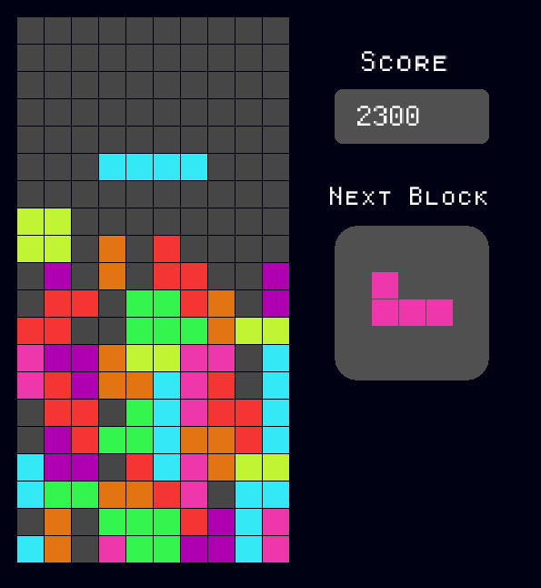

# Tetris Game

A classic Tetris game built with C++ and raylib.




## Features

- Classic Tetris gameplay
- Score tracking
- Game over screen
- Sound effects

# Tetrominoes

The game has 7 different tetrominoes that each have a distinct color. Each tetromino appears once every cycle and randomly each time


## Installation

### Windows

**Download and run the setup:**
    Download the game installer from [this link](TetrisSetup.exe) and run the setup to install the game.

### Linux

1. **Clone the repository:**
    ```sh
    git clone https://github.com/WhoisCipher/Tetris.git
    cd Tetris
    ```

2. **Install raylib:**
    Ensure raylib is installed on your device. Visit the [raylib installation guide](https://github.com/raysan5/raylib) for detailed instructions.

3. **Build the project:**
    ```sh
    make
    ```

4. **Run the game:**
    ```sh
    ./tetris
    ```

### macOS

1. **Clone the repository:**
    ```sh
    git clone https://github.com/WhoisCipher/Tetris.git
    cd Tetris
    ```

2. **Install raylib:**
    Make sure raylib is installed on your device. Follow the [raylib installation guide](https://github.com/raysan5/raylib) for macOS-specific instructions.

3. **Build the project:**
    ```sh
    make
    ```

4. **Run the game:**
    ```sh
    ./tetris
    ```

# Controls
- Left Arrow: Move piece left
- Right Arrow: Move piece right
- Up Arrow: Rotate piece
- Down Arrow: Speed up piece
- Space: Drop piece

## Contact ✉️

For any questions or feedback, please reach out to me at [abdullah@gmail.com](mailto:abdulahshoiab@gmail.com).